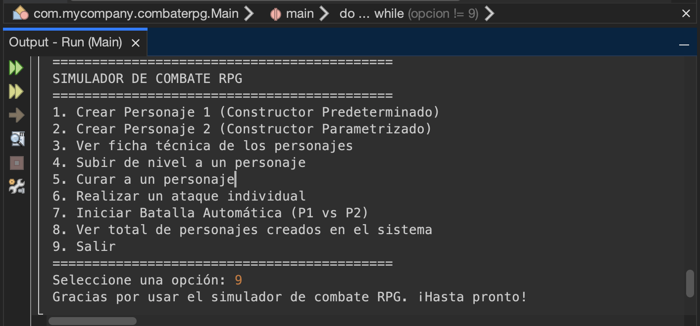
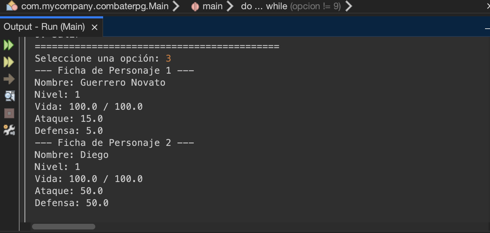

# Simulador de Combate RPG

Proyecto de Java para practicar conceptos de Programación Orientada a Objetos como clases, objetos, atributos, métodos, constructores y métodos estáticos.

## Descripción

Sistema de combate interactivo por consola donde el usuario puede crear personajes, ver sus estadísticas, realizar ataques individuales o batallas automáticas, subir de nivel y curar personajes.

## Estructura del Proyecto

- `Personaje.java`: Clase principal que representa a un personaje con sus atributos y métodos.
- `Batalla.java`: Clase con métodos estáticos para ejecutar ataques críticos y batallas automáticas.
- `Main.java`: Punto de entrada con el menú interactivo en consola.

## Requisitos

- Java 25 o superior
- JDK instalado

## Cómo Ejecutar

### Compilar

```bash
javac -d target/classes src/main/java/com/mycompany/combaterpg/*.java
```

### Ejecutar

```bash
java -cp target/classes com.mycompany.combaterpg.Main
```

## Funcionalidades

1. Crear Personaje 1 usando el constructor predeterminado
2. Crear Personaje 2 usando el constructor parametrizado
3. Ver la ficha técnica de ambos personajes
4. Subir de nivel a un personaje
5. Curar a un personaje
6. Realizar un ataque individual entre personajes
7. Iniciar una batalla automática entre ambos personajes
8. Ver el total de personajes creados en el sistema
9. Salir del programa

## Ejemplo de Ejecución

Aquí se muestra el programa en funcionamiento con el menú principal y una batalla en curso:





## Notas

- No se utilizan arreglos, listas, herencia ni polimorfismo según las restricciones del taller.
- El sistema usa Scanner para la entrada de datos por consola.
- Los atributos estáticos llevan la cuenta de cuántos personajes se han creado en total.

## Validaciones de Entrada

Aunque no lo menciona el proyecto original, decidí agregar validaciones para manejar errores cuando el usuario ingresa datos incorrectos (letras en lugar de números).

```java
try {
    opcion = Integer.parseInt(scanner.nextLine());
} catch (NumberFormatException e) {
    System.out.println("Error: debe ingresar un número entero");
    opcion = 0;
}
```

Las validaciones se aplican a:
- Opción del menú principal (debe ser entero del 1 al 9)
- Selección de personaje (opciones 4, 5, 6 - debe ser 1 o 2)
- Datos numéricos al crear Personaje 2 (vida, ataque, defensa - aceptan decimales)

## Autor

Henry Morales
