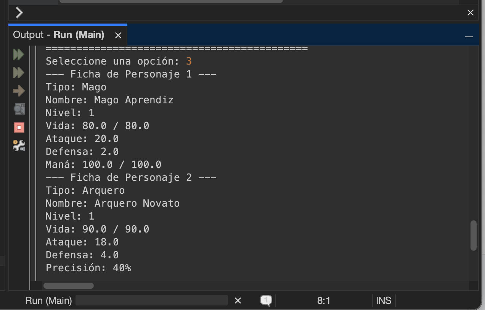
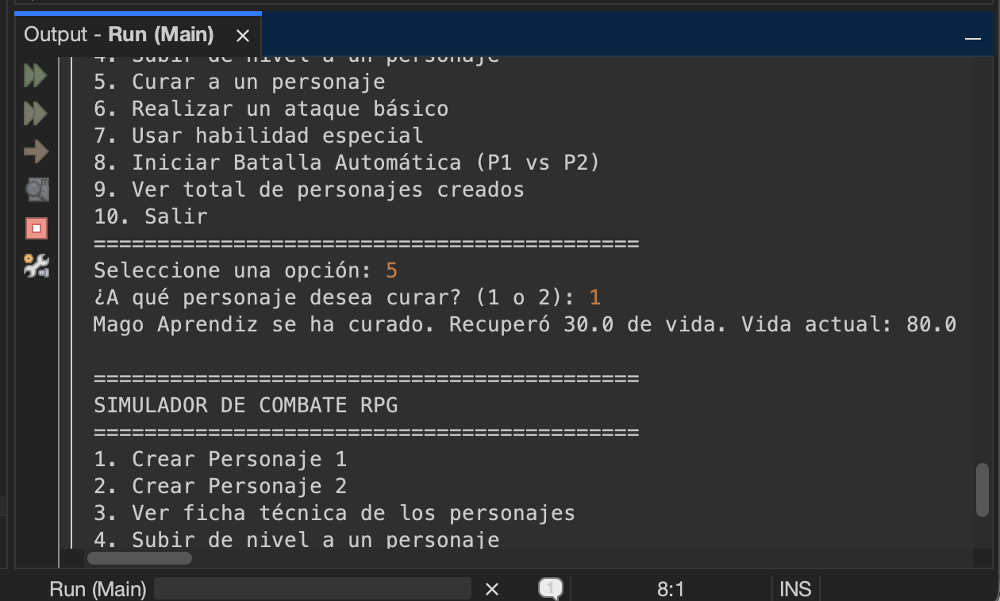
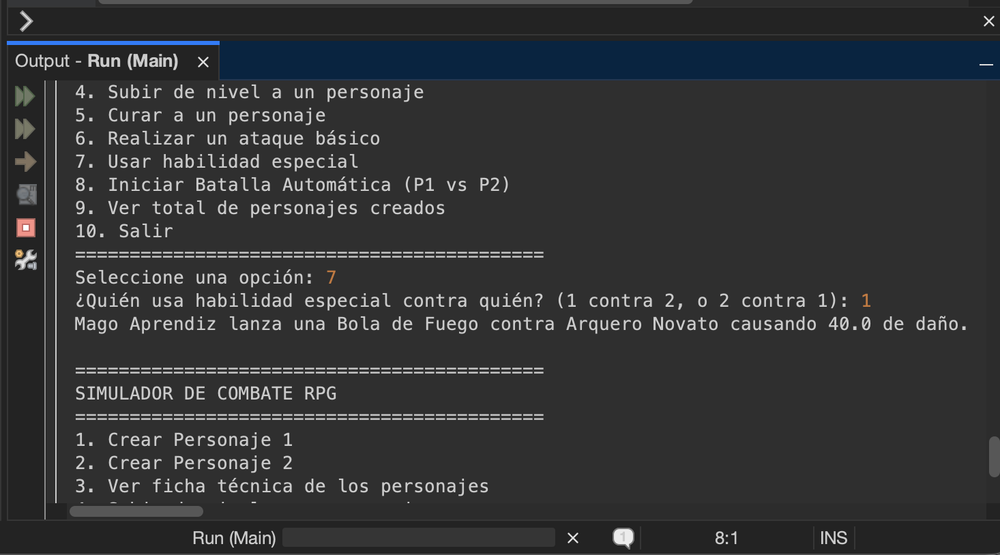
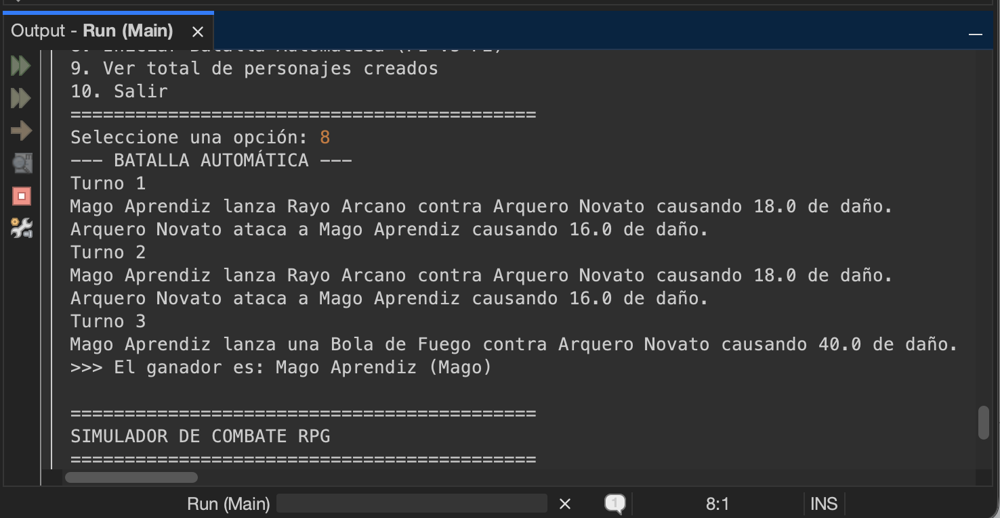

# Simulador de Combate RPG con Herencia y Polimorfismo

Proyecto de Java para practicar conceptos avanzados de Programación Orientada a Objetos como herencia, polimorfismo, clases abstractas e interfaces.

## Descripción

Sistema de combate interactivo por consola que evoluciona el taller anterior usando jerarquía de clases. Ahora hay tres tipos de personajes (Guerrero, Mago, Arquero) que heredan de una clase abstracta e implementan interfaces según sus capacidades.

## Estructura del Proyecto

- `Curable.java`: Interface para personajes que pueden curarse (Guerrero y Mago).
- `Mejorable.java`: Interface para personajes que pueden subir de nivel.
- `Personaje.java`: Clase abstracta que implementa Mejorable y define los atributos y métodos comunes.
- `Guerrero.java`: Clase concreta que extiende Personaje e implementa Curable.
- `Mago.java`: Clase concreta que extiende Personaje e implementa Curable.
- `Arquero.java`: Clase concreta que extiende Personaje (no implementa Curable).
- `Batalla.java`: Clase con métodos estáticos para batallas automáticas.
- `Main.java`: Punto de entrada con el menú interactivo en consola.

## Requisitos

- Java 25 o superior
- JDK instalado

## Cómo Ejecutar

### Compilar

```bash
javac -d target/classes src/main/java/com/mycompany/combaterpg/*.java
```

### Ejecutar

```bash
java -cp target/classes com.mycompany.combaterpg.Main
```

## Funcionalidades

1. Crear Personaje 1 (seleccionando tipo: Guerrero, Mago o Arquero)
2. Crear Personaje 2 (seleccionando tipo: Guerrero, Mago o Arquero)
3. Ver la ficha técnica de ambos personajes
4. Subir de nivel a un personaje
5. Curar a un personaje (solo Guerrero y Mago)
6. Realizar un ataque básico
7. Usar habilidad especial
8. Iniciar una batalla automática entre ambos personajes
9. Ver el total de personajes creados en el sistema
10. Salir del programa

## Tarea del Taller

Este taller requiere el uso de `instanceof` para consultar las capacidades de un objeto. Se aplica específicamente en el método `Batalla.intentarCurar()`, donde se verifica si un personaje implementa la interface `Curable` antes de permitir que se cure. Si el personaje no implementa esta interface (como el Arquero), se muestra un mensaje indicando que no puede curarse.

```java
public static void intentarCurar(Personaje p) {
    if (p instanceof Curable) {
        Curable curable = (Curable) p;
        curable.curar();
    } else {
        System.out.println(p.nombre + " no puede curarse (no implementa Curable).");
    }
}
```

Esta es la única instancia donde se permite usar `instanceof` para decidir el comportamiento del programa. Para los ataques y habilidades especiales, se usa polimorfismo en lugar de verificar el tipo del objeto.

## Conceptos Aplicados

### Herencia
- Las clases Guerrero, Mago y Arquero extienden de Personaje usando `extends`.
- Uso de `super(...)` para llamar al constructor de la clase padre.
- Uso de `this(...)` para encadenar constructores dentro de la misma clase.
- Uso de `super.método()` para reutilizar código de la clase padre en métodos sobrescritos.

### Clases Abstractas
- Personaje es una clase abstracta que no se puede instanciar directamente.
- Define métodos abstractos que cada clase hija debe implementar (atacar, habilidadEspecial, getTipo).
- Define métodos concretos que las clases hijas heredan o pueden sobrescribir.

### Interfaces
- Curable: define el método curar() y la constante CURACION_BASE.
- Mejorable: define el método abstracto subirNivel() y un método default mostrarMensajeNivel().
- Solo Guerrero y Mago implementan Curable (Arquero no puede curarse).

### Polimorfismo
- Por sobrescritura: cada clase implementa atacar() y habilidadEspecial() a su manera con @Override.
- Por referencia: variables de tipo Personaje pueden guardar objetos de Guerrero, Mago o Arquero.
- instanceof: usado en Batalla.intentarCurar() para verificar si un personaje implementa Curable.

## Ejemplo de Ejecución

Captura que muestra la creación de dos personajes de tipos distintos, una curación, una habilidad especial y una batalla automática completa:









## Notas

- Se aplican todos los conceptos de POO: herencia, polimorfismo, clases abstractas e interfaces.
- No se utilizan arreglos ni listas según las restricciones del taller.
- El sistema usa Scanner para la entrada de datos por consola.
- Los atributos estáticos llevan la cuenta de cuántos personajes se han creado en total.

## Validaciones de Entrada

Aunque no lo menciona el proyecto original, decidí agregar validaciones para manejar errores cuando el usuario ingresa datos incorrectos (letras en lugar de números). Esto hace el programa más robusto y evita que cierre inesperadamente.

```java
try {
    opcion = Integer.parseInt(scanner.nextLine());
} catch (NumberFormatException e) {
    System.out.println("Error: debe ingresar un número entero");
    opcion = 0;
}
```

Las validaciones se aplican a:
- Opción del menú principal (debe ser entero del 1 al 10)
- Selección de tipo de personaje (1, 2 o 3)
- Selección de personaje para acciones (1 o 2)
- Datos numéricos al crear personajes (vida, ataque, defensa, escudo, maná, precisión)

## Autor

Henry Morales
